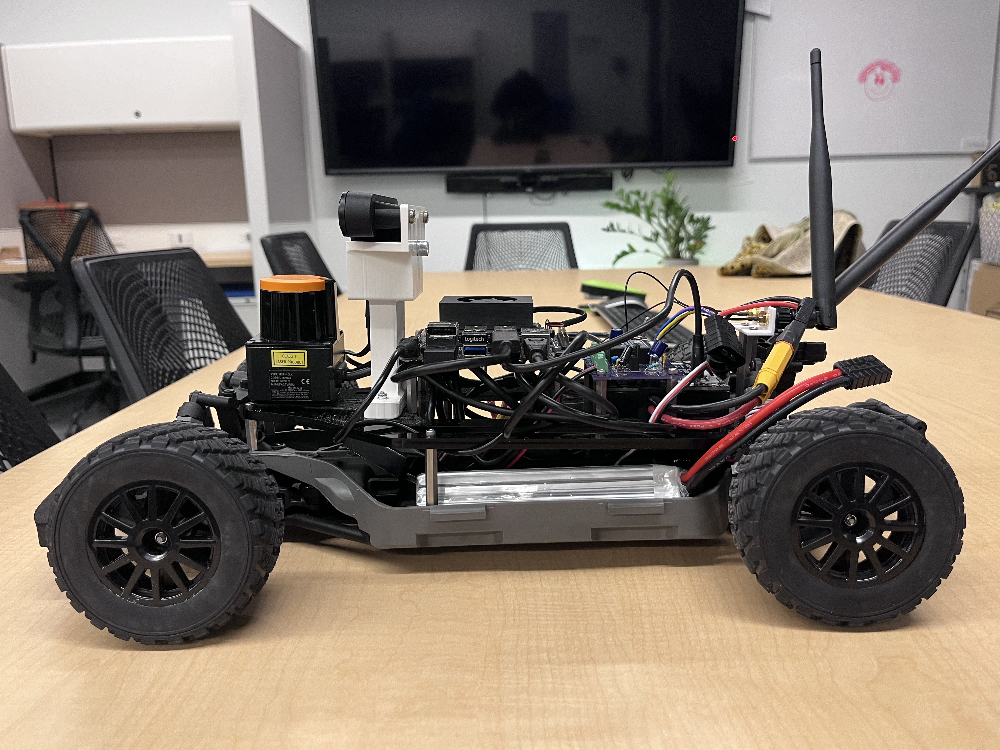
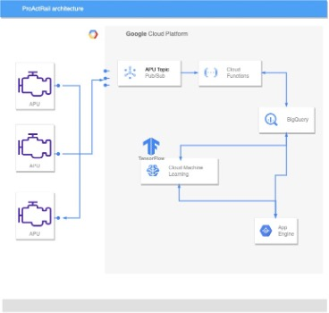

## Welcome to my Portifolio

### Autonomous Vehicle Development [F1tenth vehicle](https://f1tenth.org/about.html)

**Overview:**  
Developed two scaled-down autonomous vehicles as part of my research in autonomous driving technologies. Integrated hardware and software components for navigating complex environments.

**Description:**
- **Full Stack Development:** Implemented the complete software stack for autonomous navigation including perception, localization, planning, and vehicle control.
- **Perception :** Utilized OAK-D camera for object detection and Hokuyo lidar for localization.
- **Localization:** Implemented particle filters for accurate vehicle localization.
- **Path Planning and Control:** Developed RRT for path planning and pure pursuit algorithms for vehicle control.

**Technologies Used:**
- **Programming Languages:** C, C++, Python
- **Hardware:** Nvidia Jetson Xavier, OAK-D camera, Hokuyo lidar, VESC motor controller
- **Tools and Frameworks:** Git, CAD, linux

**Key Achievements:**
- Built and demonstrated autonomous vehicles in lab settings, enhancing the research capabilities of the lab.
- Developed robust autonomous driving software, contributing significantly to ongoing research efforts.

### ProActRail - Predictive Maintenance System for Railway Air Production Units
**Overview:**
Developed the "ProActRail" application, a sophisticated predictive maintenance system using [Streamlit](https://streamlit.io), aimed at enhancing the reliability and safety of railway systems by predicting equipment failures. This project focuses on integrating a machine learning model with cloud-based technologies to enable real-time data processing and predictive analytics.

**Descrition:**
- **Machine Learning and Predictive Analytics:** Implemented a Sparse Autoencoder (SAE) model to predict failures using deep learning techniques. This approach improved predictive accuracy and system reliability.
- **System Architecture and Integration:** Designed and executed a complete IoT solution encompassing data generation, ingestion, storage, model inference, and visualization, utilizing various Google Cloud Platform services such as Pub/Sub, App Engine, BigQuery, and Vertex AI.
- **Cloud and Big Data Management:** Managed the system's cloud infrastructure, ensuring efficient data handling, storage, and retrieval, and configured the cloud services to optimize for high-volume data processing and real-time analytics.
- **Frontend Development and Data Visualization:** Developed a user-friendly frontend application using Streamlit, enabling real-time monitoring and visualization of predictive results, which aids maintenance teams in timely decision-making.

**Technologies Used:**
- **Programming Languages:** Python
- **Frameworks and Libraries:** Streamlit, TensorFlow (SAE models), scikit-learn
- **Cloud Technologies:** Google Cloud Platform (Pub/Sub, BigQuery, App Engine, Vertex AI)
- **Data Management:** BigQuery for data storage and SQL for querying

**Key Achievements:**
- Enhanced predictive maintenance capabilities by integrating machine learning with IoT, resulting in a system that predicts equipment failures with high accuracy and minimal false positives.
- Developed a robust cloud-based architecture capable of real-time data processing and analytics, significantly improving operational efficiency and system reliability.
- Provided a comprehensive solution from data generation to visualization, demonstrating an ability to design and manage complex systems, a valuable asset for Sarcomere Dynamics' multidisciplinary engineering projects.

**Project Link:** [ProActRail on GitHub](https://github.com/9elmo6/ProActRail)

[back](./)
